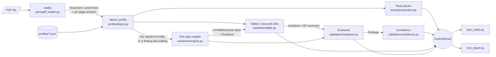

# invoice-extractor

A small, dependency-light Python library and CLI that turns a PDF invoice into a typed,
structured result — and keeps the reasoning behind every value inspectable, not just the
value itself. Each of the ten scalar fields and every line item carries its own
`Evidence` (page, bounding box, matched label, extraction strategy) back to the source
PDF. Every cross-field consistency check — do the totals reconcile, do the line items
sum to the subtotal, is the VAT rate consistent — runs as a named invariant that emits a
`Finding` (`INFO` / `WARNING` / `ERROR`) instead of silently passing or raising. And
every field's confidence is a transparent, weighted sum of named signals (label matched
exactly? in the expected zone? validator passed? single candidate? invariants agree?),
stored alongside the value as `confidence_breakdown`. Nothing is inferred and then
hidden: a reviewer can trace any number in the output back to the pixels it came from.

## See it run

```bash
make install   # pip install -e ".[dev]"
make demo      # extract one corpus document and print the report
```

`tests/forge/fixtures/corpus/0001_fr-FR_classic_s7.pdf` is one of the documents
`invoice_forge` generates and this repository commits: a French invoice from Valmont
Systèmes SAS (Lyon, VAT `FR7P585117668`), French labels, `1 234,56`-style numbers, drawn
from the same `profiles/fr-FR.json` the extractor then reads it back with. `make demo`
runs:

```bash
python -m invoice_extractor extract tests/forge/fixtures/corpus/0001_fr-FR_classic_s7.pdf --report
```

No vendor is named on that command line. The extractor is handed the directory of
profiles and works out which one printed the document; a document that matches none of
them comes back with `profile_not_detected`, `valid: false` and nothing read, rather than
a plausible-looking result read with the wrong vocabulary (ADR-0008).

It prints:

```
Invoice Extraction Report
================================================================================
source   tests/forge/fixtures/corpus/0001_fr-FR_classic_s7.pdf
profile  fr-FR
kind     invoice

FIELD             VALUE                              CONF  EVIDENCE
--------------------------------------------------------------------------------
invoice_number    FAC-2024-608064                    1.00  p1  LABEL_BESIDE  "Facture n°"
order_number      PO-835601                          1.00  p1  LABEL_BESIDE  "Commande n°"
customer_number   C-59795                            1.00  p1  LABEL_BESIDE  "Numéro client"
invoice_date      2024-06-14                         1.00  p1  LABEL_BESIDE  "Date"
supply_date       2024-06-08                         0.95  p1  LABEL_BESIDE  "Date de livraison"
due_date          2024-06-28                         1.00  p1  LABEL_BESIDE  "Échéance"
supplier_vat_id   FR7P585117668                      1.00  p1  ANCHOR  "FR7P585117668"
customer_vat_id   FR3P030824628                      1.00  p1  LABEL_RIGHT  "N° TVA du client"
currency          EUR                                1.00  p1  DERIVED  -
vat_rate          20                                 1.00  p1  BLOCK_ROW  "Taux de TVA"
subtotal          11241.25                           1.00  p1  BLOCK_ROW  "Total HT"
vat_amount        2248.25                            1.00  p1  BLOCK_ROW  "TVA"
total_amount      13489.50                           1.00  p1  BLOCK_ROW  "Net à payer"
contract_number   -                                  0.00  -
our_reference     -                                  0.00  -
your_reference    REF-1064                           0.99  p1  LABEL_BESIDE  "Votre réf."
credit_reference  -                                  0.00  -
payment_terms     Règlement à 45 jours fin de mois.  0.99  p1  LABEL_RIGHT  "Modalités de règlement"

Parties
supplier   Valmont Systèmes SAS · 124 rue Lavoisier · 85337 Nantes · France · FR7P585117668
bill_to    Valmont Systèmes SA · 27 avenue du Port · 99351 Toulouse · France · FR3P030824628
ship_to    Clairbois Systèmes SARL · 179 avenue du Port · 31948 Rennes · France

Line items (4)
PART NUMBER  DESCRIPTION                                              QTY  UNIT PRICE  NET AMOUNT
--------------------------------------------------------------------------------
SW-API-10K   Forfait API, 10 000 appels par mois                      100       89.00     8900.00
SRV-WRT-Q    Maintenance, forfait trimestriel, installation type B    7.5      245.50     1841.25
SW-CLD-50    Stockage cloud 50 Go, facturation mensuelle                2     12.5000       25.00
SRV-INST-H   Installation sur site, à l'heure                           5       95.00      475.00

VAT summary (1)
CODE    RATE      BASE      VAT
--------------------------------------------------------------------------------
-         20  11241.25  2248.25

Checks
[ok]  subtotal_plus_vat_equals_total              11241.25 + 2248.25 = 13489.50
[ok]  line_items_sum_equals_subtotal              11241.25 (rows) = 11241.25
[--]  line_items_sum_equals_total_when_no_vat     the document charges tax
[ok]  vat_equals_subtotal_times_rate              20% x 11241.25 = 2248.25
[ok]  per_rate_vat_consistency                    1 line(s) tax their base at their rate
[ok]  summary_base_sums_equal_subtotal            11241.25 (bases) = 11241.25
[ok]  summary_vat_sums_equal_vat_total            2248.25 (summary) = 2248.25
[ok]  line_totals_plus_charges_equal_grand_total  11241.25 + 2248.25 = 13489.50
[ok]  line_items_vat_sum_equals_vat_total         2248.25 (rows) = 2248.25
[ok]  document_type_matches_total_sign            invoice with a total of 13489.50
[--]  invoice_number_in_filename                  the file name claims no document
[ok]  vat_prefix_matches_country                  FR7P585117668 is a FR registration
[ok]  dates_in_order                              2024-06-08 <= 2024-06-14 <= 2024-06-28
[ok]  currency_agrees_across_families             the amounts add up in EUR
[ok]  customer_vat_differs_from_supplier          FR3P030824628 is not FR7P585117668
[ok]  bill_to_country_matches_customer_vat        billed in France
[--]  credit_note_references_invoice              the document is not a credit note

0 error, 0 warning, 0 info findings
================================================================================
```

Both dates on that page are spelled `14 juin 2024`. `datetime.strptime` reads month
names in the C locale, which is English, so the profile's own calendar — the same lexicon
its labels come from — is what turns `juin` into a month before the format is applied.
The three fields that come back empty are ones this vendor did not print; the report says
so with a dash rather than guessing.

`--json out.json` writes the same result as machine-readable JSON — full `Evidence`
bounding boxes included, `Decimal` values as strings, dates as ISO-8601. Exit code is
`0` whenever extraction ran at all, however many findings it returned; non-zero only for
input the pipeline never even started on (a missing PDF, a malformed profile).

## How data flows

`pipeline.py` is the only place these stages are wired together. Every module is
independently testable against a `Document` built in memory — no PDF required.



Full narrative: [docs/ARCHITECTURE.md](docs/ARCHITECTURE.md).

## Design principles

1. **A field is declared, not subclassed.** A spec (`extraction/spec.py`) names
   behaviour — a normalizer, a validator, filters, rankers, what to do when nothing
   passes — and never implements it: every name it uses is registered in
   `extraction/units/registry.py`, and a typo is an import error rather than a field that
   silently never resolves. The fields are a flat list of values in
   `extraction/specs.py`, run by one generic `extraction/engine.py`. —
   [ADR-0001](docs/adr/0001-field-specs-declared-not-subclassed.md)
2. **Every value carries its evidence.** `Evidence(page, bbox, matched_label, strategy,
   raw_text)` (`domain/models.py`) records where each `FieldResult` came from; nothing
   is extracted without a trail back to the source PDF. —
   [ADR-0002](docs/adr/0002-every-value-carries-evidence.md)
3. **Money is `Decimal`, never `float`.** `domain/money.py` owns all monetary
   arithmetic; a `Decimal` round-trips through JSON as a string, never a native number,
   so invariant tolerances measure real rounding, not floating-point noise. —
   [ADR-0003](docs/adr/0003-money-is-decimal-never-float.md)
4. **A vendor description is data.** Labels, zones, patterns and formats live in
   `profiles/*.json`, validated by `profile/loader.py`; nothing in `extraction/`
   hardcodes a vendor's vocabulary. —
   [ADR-0004](docs/adr/0004-layouts-are-data.md)
5. **Findings, not exceptions, for domain errors.** A broken invariant or an unmatched
   field becomes a `Finding` (`domain/findings.py`, severity `INFO`/`WARNING`/`ERROR`)
   on the result; exceptions stay reserved for input the pipeline cannot even start
   on. — [ADR-0005](docs/adr/0005-findings-not-exceptions-for-domain-errors.md)
6. **The unit of configuration is a vendor profile, shared with the generator.** One
   `profiles/<id>.json` per vendor carries its language, locale, currencies, VAT rules,
   label vocabulary, tables and totals block; the generator draws what it says and the
   extractor reads it back, so every profile is testable end to end. —
   [ADR-0006](docs/adr/0006-profiles-not-layouts.md)

## Project layout

```
src/invoice_extractor/
    domain/        Evidence, FieldResult, LineItem, VatSummaryRow, Party, Finding, Money
    document/      PDF -> Document: pages of zoned TextLines and the runs they were drawn in
    profile/       Profile schema, strict loader, merge rules, registry, detection, lint
    extraction/    One engine, five spec kinds; units/: the vocabulary they name
    validation/    Invariants (as Findings) and explainable confidence
    output/        JSON writer and human-readable text report
    pipeline.py    The only orchestration: PDF + registry -> InvoiceResult
    cli.py         python -m invoice_extractor
src/invoice_forge/
    layout/        The five template families, declared; knobs applied to a declaration
    sample/        What a document says: parties, catalogue, identifiers, variations
    render/        The declaration drawn to a page, recording every box it printed
    truth/         The truth file, and reading every box back out of the PDF to check it
    corpus/        A plan, run into a directory; the coverage report over what came out
profiles/           One JSON per vendor, read by both packages (ADR-0006)
lexicon/            One JSON per language: every label an invoice prints, with synonyms
benchmarks/         make bench: the extractor over the corpus, scored against the truth
corpus/             plan.json (committed); the documents are regenerated, not stored
tests/              unit (one module each), integration (fixtures, determinism), hygiene
docs/               architecture, profile format, ADRs, implementation and engine plans
```

## Extending

**Add a vendor.** Drop a new `profiles/<id>.json` — language, locale, currencies, VAT
rules, the supplier as it prints itself, and whatever it calls each field (see
[docs/PROFILE_FORMAT.md](docs/PROFILE_FORMAT.md)). `profile/loader.py` validates it and
raises `ProfileError` naming the exact bad key; `profiles/_defaults.json` and the
language's lexicon supply everything the file does not say. No Python change, and the
generator can render the same file to prove the profile describes a real invoice.

**Add a field.** Four small edits and a test — `engine.py`, `pipeline.py` and every unit
stay untouched. Adding `purchase_order`, in full:

1. `docs/FIELD_CATALOG.md` — add `purchase_order`, the one place a canonical name is
   named; both packages and the benchmark read it from there.
2. `domain/models.py` — add `"purchase_order": str` to `VALUE_TYPES`, so `from_dict`
   restores the value with the type `to_dict` wrote it as.
3. `extraction/specs.py` — one entry, in the position the field should be reported in:

   ```python
   LabelSpec(
       name="purchase_order",
       normalizer="strip_label",
       validator="is_identifier",
       rankers=BY_LABEL,
   )
   ```

   Every name in it is looked up in `extraction/units/registry.py` when the module is
   imported; a behaviour no unit provides is a new unit there, registered under its name.

4. `profiles/_defaults.json` — `"purchase_order": {"labels":
   ["@header_labels.purchase_order"], "zones": ["r1c3"]}`, once, for every vendor that
   prints it in its language's own words.
5. A unit test in `tests/unit/test_engine.py` against a `Document` built in memory, and
   one in `tests/unit/units/` for any unit the field needed that did not exist.

The field appears in the JSON, in the report and in `confidence_breakdown` with no other
change: the engine already runs whatever `SPECS` holds.

## How good is it, measured

`invoice_forge` generates a corpus of synthetic invoices with exact ground truth —
twenty-two vendor profiles over sixteen languages, five template families, and
thirty-one difficulty knobs from [docs/VARIATION_CATALOG.md](docs/VARIATION_CATALOG.md).
`make bench` runs this extractor over all of it and scores every value against the truth
beside it. Each document is read back with the very profile it was printed from, so what
is measured is the extraction engine and not label guessing.

<!-- benchmark:begin -->
Over the 250-document base corpus (`make corpus`), `make bench`
measures this release at:

- **Profile detection:** 100.0% (250 of 250); a document no profile matches is
  reported and not read (ADR-0008).
- **Scalar fields:** 99.8% (3672 of 3681) of the values the documents carry.
- **Line-item cells:** 100.0% (29077 of 29077), over
  250 of 250 documents whose row count was read
  exactly.
- **Party blocks:** 100.0% (1390 of 1390) of the names and
  addresses the documents print.
- **Totals block:** 100.0% (32 of 32) of the charges the
  documents carry, declared on the page or inferred from the arithmetic.
- **Confidence:** 0.8-1.0 at 99.8%.
- **Calibration:** the confidences are off by 0.5% on average, over the
  weights and the curve `calibration/` was fitted with.
- **Not covered:** the generator prints these and the extractor has no spec for
  them, so they are never scored as wrong:
  nothing.

0 of those 9 misses found no candidate at all, rather than reading
the wrong one (9). A field that found nothing was printed a way none
of its strategies looks; `benchmarks/README.md` says which fields, on which
profiles and in which families.

`benchmarks/README.md` is the field-by-field matrix, by profile, by family and by
knob.
<!-- benchmark:end -->

The confidence beside a value is fitted rather than assumed. `invoice-extractor
calibrate --corpus corpus/ --out calibration/` measures, per field, what each of the
sixteen signals tells apart and what a score of each size has actually been worth, and
writes [calibration/weights.json](calibration/weights.json),
[calibration/calibration_maps.json](calibration/calibration_maps.json) and
[calibration/reliability_report.json](calibration/reliability_report.json) — predicted
against observed, in ten bands, per field. The run is deterministic and the files are
committed like code: promoting a fit is a reviewed change, not a side effect.

On this corpus no signal yet separates the nine values the extractor gets wrong from the
3,483 it gets right, so `weights.json` is empty and every field is scored with the
uniform mean of the signals it emitted; the curve is what the fit has to say so far, and
`reliability_report.json` marks each field `fitted: false` to say exactly that.

## Quality gates

`make check` (lint + typecheck + test + hygiene) is the one gate every pull request must
pass — see [docs/IMPLEMENTATION_PLAN.md](docs/IMPLEMENTATION_PLAN.md).

| Command | Enforces |
|---|---|
| `make lint` | `ruff check` + `ruff format --check` (E, F, I, N, UP, B, SIM, RUF; line length 100) |
| `make typecheck` | `mypy --strict` on `src/` and `benchmarks/` (`pymupdf` is the one ignored import) |
| `make test` | `pytest --cov=invoice_extractor --cov=invoice_forge --cov-fail-under=90` |
| `make corpus` | regenerates the 250-document base corpus from `corpus/plan.json`, byte for byte |
| `make bench` | scores the extractor over that corpus and rewrites every published figure |
| hygiene test | `src/` <= 2200 non-blank/non-comment lines; no module > 250 lines; no function > 40 lines; `pymupdf` in the two PDF modules only; no `print`, no work markers, no unjustified suppressions, no absolute paths or e-mail addresses, every relative markdown link resolves |

`.github/workflows/ci.yml` runs the same `make check` on every push and pull request.
Nothing merges that hasn't passed it.

**Supported Python:** 3.11 and 3.12 — the two versions CI runs, and the floor
`requires-python` declares.

**Running one test:** `pytest tests/unit/test_normalizers.py -k parse_money --no-cov`.
`make test` measures coverage over the whole suite, so a single test needs `--no-cov` to
skip the 90% floor it cannot meet on its own.

## Status

v0.3.0 is the full-capability extractor. v0.1.0 was ten scalar fields, a line-item table,
three invariants and a text report. v0.2.0 added `invoice_forge` — a generator of
synthetic invoices with exact ground truth, twenty-two vendor profiles in sixteen
languages, five template families, thirty-one difficulty knobs and a 250-document base
corpus — and the benchmark that measures the extractor against it. v0.3.0 rebuilt the
extractor on that: a vendor is a **profile** rather than a layout, one engine runs six
kinds of spec over it, the result carries the rows, the party blocks, the totals block,
the charges and the second currency, every rule the document was put through comes back
as a `Check`, and the confidence beside every value is fitted on the corpus rather than
assumed. [docs/ENGINE_SPEC.md](docs/ENGINE_SPEC.md) is the design and
[docs/ENGINE_PLAN.md](docs/ENGINE_PLAN.md) the plan it was built to, one gated pull
request at a time. All of it is green under `make check` on Python 3.11 and 3.12. This
repository started from a
fully specified seed — architecture, ADRs, the configuration format, fixtures, CI —
implemented afterward one gated pull request at a time;
[docs/IMPLEMENTATION_PLAN.md](docs/IMPLEMENTATION_PLAN.md) is the plan v0.1.0 was built
to and [docs/FORGE_PLAN.md](docs/FORGE_PLAN.md) the plan v0.2.0 was, and
[CHANGELOG.md](CHANGELOG.md) is what shipped.

## License

MIT — see [LICENSE](LICENSE).
