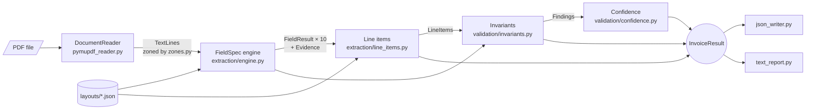

# invoice-extractor

A small, dependency-light Python library and CLI that turns a PDF invoice into a typed,
structured result — and keeps the reasoning behind every value inspectable, not just the
value itself. Each of the ten scalar fields and every line item carries its own
`Evidence` (page, bounding box, matched label, extraction strategy) back to the source
PDF. Every cross-field consistency check — do the totals reconcile, do the line items
sum to the subtotal, is the VAT rate consistent — runs as a named invariant that emits a
`Finding` (`INFO` / `WARNING` / `ERROR`) instead of silently passing or raising. And
every field's confidence is a transparent, weighted sum of named signals (label matched
exactly? in the expected zone? validator passed? single candidate? invariants agree?),
stored alongside the value as `confidence_breakdown`. Nothing is inferred and then
hidden: a reviewer can trace any number in the output back to the pixels it came from.

## See it run

```bash
make install   # pip install -e ".[dev]"
make samples   # regenerate samples/*.pdf + samples/*.expected.json, deterministically
make demo      # extract samples/acme_invoice.pdf and print the report
```

`samples/acme_invoice.pdf` is a fictional UK -> DE invoice — Acme Components Ltd
(Manchester, VAT `GB123456789`) billing Nordwind Logistik GmbH (Hamburg, VAT
`DE123456789`), English labels, `1,234.56`-style numbers. `make demo` runs:

```bash
python -m invoice_extractor samples/acme_invoice.pdf --layout acme --report
```

and prints:

```
Invoice Extraction Report
================================================================================
source   samples/acme_invoice.pdf
layout   acme

FIELD            VALUE          CONF  EVIDENCE
--------------------------------------------------------------------------------
invoice_number   INV-2024-0042  1.00  p1  LABEL_RIGHT  "Invoice Number"
invoice_date     2024-03-15     1.00  p1  LABEL_RIGHT  "Invoice Date"
due_date         2024-04-14     1.00  p1  LABEL_RIGHT  "Due Date"
supplier_vat_id  GB123456789    1.00  p1  LABEL_RIGHT  "VAT Number"
customer_vat_id  DE123456789    1.00  p1  LABEL_RIGHT  "Customer VAT Number"
currency         GBP            1.00  p1  LABEL_RIGHT  "Currency"
vat_rate         20.00          1.00  p1  LABEL_RIGHT  "VAT Rate"
subtotal         490.00         1.00  p1  LABEL_RIGHT  "Subtotal"
vat_amount       98.00          1.00  p1  LABEL_RIGHT  "VAT Amount"
total_amount     588.00         1.00  p1  LABEL_RIGHT  "Total Due"

Line items (3)
SKU       DESCRIPTION               QTY  UNIT PRICE  NET AMOUNT
--------------------------------------------------------------------------------
ACM-1001  Hex bolt M8 x 40, zinc    500        0.12       60.00
ACM-2210  Bearing 6204-2RS           40        3.85      154.00
ACM-3300  Steel bracket, 3 mm       120        2.30      276.00

Invariants
[ok]  totals_reconcile     490.00 + 98.00 = 588.00
[ok]  line_items_sum       60.00 + 154.00 + 276.00 = 490.00
[ok]  vat_rate_consistent  20.00% x 490.00 = 98.00

0 error, 0 warning, 0 info findings
================================================================================
```

`--json out.json` writes the same result as machine-readable JSON — full `Evidence`
bounding boxes included, `Decimal` values as strings, dates as ISO-8601. Exit code is
`0` whenever extraction ran at all, however many findings it returned; non-zero only for
input the pipeline never even started on (a missing PDF, a malformed layout).

## How data flows

`pipeline.py` is the only place these stages are wired together. Every module is
independently testable against a `FakeDocument` — no PDF required.



Full narrative: [docs/ARCHITECTURE.md](docs/ARCHITECTURE.md).

## Design principles

1. **A field is declared, not subclassed.** `FieldSpec(name, strategy, normalizer,
   validator, rankers, on_all_invalid)` (`extraction/spec.py`) names five behaviours
   instead of implementing them per field; the ten fields are a flat list of values in
   `extraction/specs.py`, run by one generic `extraction/engine.py`. —
   [ADR-0001](docs/adr/0001-field-specs-declared-not-subclassed.md)
2. **Every value carries its evidence.** `Evidence(page, bbox, matched_label, strategy,
   raw_text)` (`domain/models.py`) records where each `FieldResult` came from; nothing
   is extracted without a trail back to the source PDF. —
   [ADR-0002](docs/adr/0002-every-value-carries-evidence.md)
3. **Money is `Decimal`, never `float`.** `domain/money.py` owns all monetary
   arithmetic; a `Decimal` round-trips through JSON as a string, never a native number,
   so invariant tolerances measure real rounding, not floating-point noise. —
   [ADR-0003](docs/adr/0003-money-is-decimal-never-float.md)
4. **A vendor layout is data.** Labels, zones, regexes and formats live in
   `layouts/*.json`, validated by `layout/loader.py`; nothing in `extraction/`
   hardcodes a vendor's vocabulary. The two bundled layouts — `acme` (English, GBP) and
   `nordic` (Swedish, SEK) — exercise the same code path. —
   [ADR-0004](docs/adr/0004-layouts-are-data.md)
5. **Findings, not exceptions, for domain errors.** A broken invariant or an unmatched
   field becomes a `Finding` (`domain/findings.py`, severity `INFO`/`WARNING`/`ERROR`)
   on the result; exceptions stay reserved for input the pipeline cannot even start
   on. — [ADR-0005](docs/adr/0005-findings-not-exceptions-for-domain-errors.md)

## Project layout

```
src/invoice_extractor/
    domain/        Evidence, FieldResult, LineItem, InvoiceResult, Money, Finding
    document/      PDF -> TextLine, zoned on a 3x3 grid (DocumentReader Protocol)
    layout/        Layout JSON schema + loader (LayoutError names the bad key)
    extraction/    FieldSpec engine: strategies, normalizers, validators, rankers
    validation/    Invariants (as Findings) and explainable confidence
    output/        JSON writer and human-readable text report
    pipeline.py    The only orchestration: PDF + layout -> InvoiceResult
    cli.py         python -m invoice_extractor
layouts/            acme.json, nordic.json
samples/            Generated sample PDFs + golden *.expected.json
tests/              unit (one module each), integration (golden, determinism), hygiene
docs/               architecture, layout format, ADRs, implementation plan
```

## Extending

**Add a layout.** Drop a new `layouts/<id>.json` — labels, zones, regex, date/number
formats (see [docs/LAYOUT_FORMAT.md](docs/LAYOUT_FORMAT.md)). `layout/loader.py`
validates it and raises `LayoutError` naming the exact bad key. No Python change.

**Add a field.** One `FieldSpec` entry in `extraction/specs.py` (strategy, normalizer,
validator, rankers, `on_all_invalid`), the matching `labels`/`zones`/`regex` in every
layout JSON, and a unit test. `engine.py` and `pipeline.py` stay untouched.

## Quality gates

`make check` (lint + typecheck + test + hygiene) is the one gate every pull request must
pass — see [docs/IMPLEMENTATION_PLAN.md](docs/IMPLEMENTATION_PLAN.md).

| Command | Enforces |
|---|---|
| `make lint` | `ruff check` + `ruff format --check` (E, F, I, N, UP, B, SIM, RUF; line length 100) |
| `make typecheck` | `mypy --strict` on `src/` (`fitz` is the one ignored import) |
| `make test` | `pytest --cov=invoice_extractor --cov-fail-under=90` |
| hygiene test | `src/` <= 2200 non-blank/non-comment lines; no module > 250 lines; no function > 40 lines |

`.github/workflows/ci.yml` runs the same `make check` on every push and pull request.
Nothing merges that hasn't passed it.

## Status

v0.1.0 is in progress. This repository starts from a fully specified seed —
architecture, ADRs, layout format, sample fixtures, CI — implemented afterward one gated
pull request at a time. [docs/IMPLEMENTATION_PLAN.md](docs/IMPLEMENTATION_PLAN.md) is
the source of truth for what's done and what's next.

## License

MIT — see [LICENSE](LICENSE).
