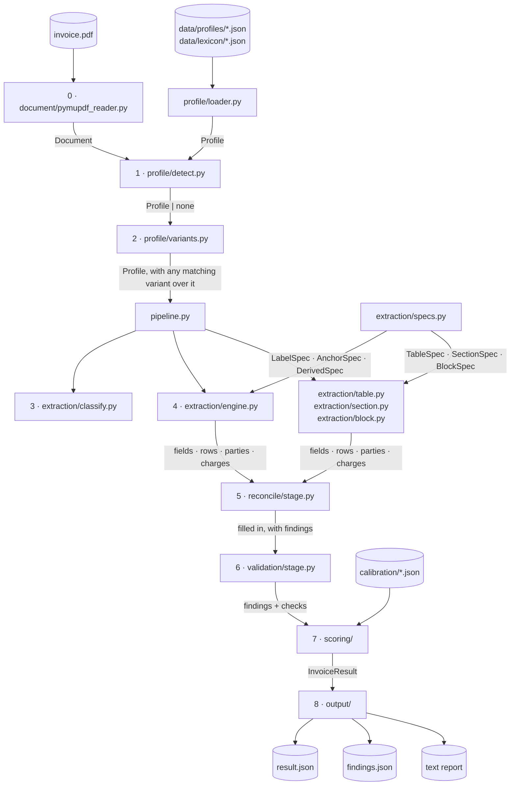
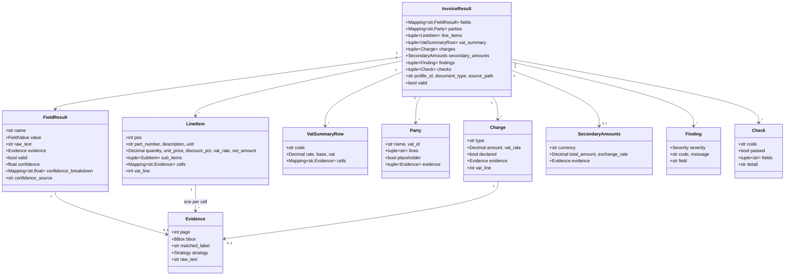
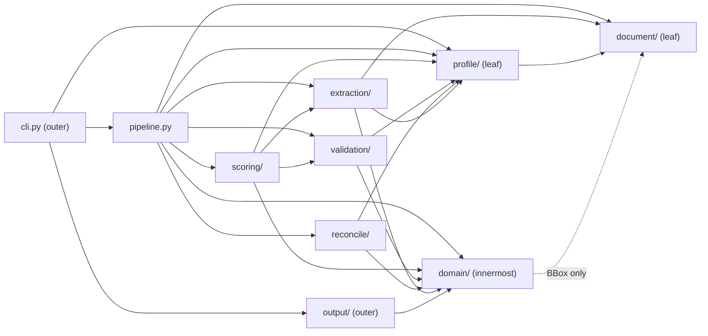

# Architecture

`invoice-extractor` turns a PDF invoice into a typed, evidence-backed, arithmetically
checked, confidence-scored `InvoiceResult`. The design fits in one sentence: **read the
page once, describe each vendor as data rather than as code, and never let a value travel
without the evidence that produced it.** `docs/ENGINE_SPEC.md` is the contract this
document describes; where the two disagree, the spec wins.

Three ideas carry the whole design:

- **A vendor is a profile, not a branch** (ADR-0006). Everything that varies between
  vendors — labels, zones, separators, calendars, column headings, the components of the
  totals block — is `src/invoice_extractor/data/profiles/*.json` plus the lexicons beside them,
  which ship inside the package. No module names a vendor.
- **One engine, six spec kinds** (ADR-0007). A field is a declaration naming registered
  units; the engine runs every kind through the same steps. Adding a field is an entry in
  `extraction/specs.py`, not a new code path.
- **Nothing is published without evidence** (ADR-0002), and nothing raises for a document
  that disagrees with itself (ADR-0005). A page, a box and the text it was read from ride
  with every value; what is wrong with the document comes back as a `Finding`.

## 1. The eight stages

`pipeline.py` is the only module that runs the stages. Each stage is a package with one
public entry point; each hands the next one values, never control.

| # | Stage | Module | In → out |
|---|---|---|---|
| 0 | read | `document/pymupdf_reader.py` | a PDF → `Document` of `Page`s, each line with its box, its zone and the page's anchors |
| 1 | detect the profile | `profile/detect.py` | `Document` → the best-scoring `Profile`, or none at all (ADR-0008) |
| 2 | select the variant | `profile/variants.py` | `Profile` → the same profile with the first matching fingerprint (`when`) laid over it, re-merged and re-validated through the one loader |
| 3 | classify | `extraction/classify.py` | `Document` → invoice or credit note, in the vendor's own words |
| 4 | extract | `extraction/engine.py`, `table.py`, `section.py`, `block.py` | specs → the fields, the rows, the party blocks, the totals block |
| 5 | reconcile | `reconcile/stage.py` | what was read → what the document left out, said out loud |
| 6 | validate | `validation/stage.py` | the whole document → seventeen `Check`s and the `Finding`s they produced |
| 7 | score | `scoring/` | signals per field → one confidence per field, with what it was made of |
| 8 | emit | `output/` | `InvoiceResult` → `result.json`, its findings mirror, and the text report |



## 2. Domain model

`domain/` is the innermost ring: what a run produces, and the JSON it round-trips
through. It knows about boxes and money, and about nothing else in the project.



Three things this diagram is saying:

- **Evidence is at the grain of the value.** A field has one box; a row has one per cell;
  a party block has one per line. A charge the block declared has one, and a charge only
  the arithmetic found has none — which is how a reader tells them apart.
- **`valid` is derived, never set.** It is "no finding of severity ERROR" (ADR-0010).
- **A `Finding` says what is wrong; a `Check` says what was asked.** A rule that held and
  a rule that could not apply to this document are different facts, and the findings
  alone cannot tell them apart.
- **A row carries the VAT line that taxes it.** Stage 5 works out which line of the
  summary each item and each charge is taxed by; `vat_line` is where that answer is
  published, and it is `None` where the document prints no summary or where more than one
  line could be the row's — an ambiguous linkage is a finding, never a guess.

## 3. The six boundaries

| # | Boundary | Rule |
|---|---|---|
| 1 | PDF library | `pymupdf` is imported nowhere except `document/pymupdf_reader.py`. Everything above it sees `Document`, `Page`, `TextLine`, `BBox` — swapping the library touches one file. A hygiene test enforces it. |
| 2 | Profile format | Only `profile/loader.py` and its helpers (`parts.py`, `blocks.py`, `reading.py`, `lexicon.py`, `merge.py`) know the JSON shape. Everything else receives a typed `Profile`. Every key the loader accepts becomes a field of a record, and every field comes from a key: `tests/test_profile_contract.py` holds both directions. |
| 3 | Units | `extraction/units/` are pure functions registered by name. The vocabulary is closed in both directions — every registered unit is named by a spec, and every name a spec uses is registered (`tests/test_unit_registry.py`). |
| 4 | Declarations | `extraction/specs.py` holds declarations, never values and never behaviour. A spec that names a unit, a profile path or a dependency that does not exist fails at import. |
| 5 | Orchestration | `pipeline.py` is the only module that runs the stages. Nothing else opens a document, loops over the specs, or decides what happens next. |
| 6 | Output | `output/` serializes an already-built result. It never computes a value, re-derives a confidence, or re-runs a check — the text report prints the `detail` each check already came to. |

## 4. Module responsibilities

| Module | Responsibility | Depends on |
|---|---|---|
| `__init__.py` | Public API: `extract`, `load_profile`, `ProfileRegistry`, `InvoiceResult`, `__version__`. | `pipeline`, `profile`, `domain.models` |
| `cli.py` (+ `__main__.py`) | `extract`, `inspect`, `profile lint`, `profile draft`, `calibrate`. Parses arguments, calls one function, writes what it returns. | `pipeline`, `profile.*`, `drafting.*`, `scoring.calibrate`, `output.*` |
| `pipeline.py` | The eight stages, wired. Nothing else. | every package below |
| `domain/models.py` | `FieldResult`, `InvoiceResult`, `to_dict`/`from_dict`, and the field → type map. | `domain.*`, `document.model` (`BBox`) |
| `domain/evidence.py` | `Evidence` and the closed `Strategy` vocabulary that records how a value was found. | `document.model` (`BBox`) |
| `domain/findings.py`, `domain/checks.py` | `Finding` (what is wrong) and `Check` (what was asked), with their severities and their JSON. | — |
| `domain/rows.py`, `parties.py`, `totals.py` | `LineItem`, `SubItem`, `VatSummaryRow`, `Party`, `Charge`, `SecondaryAmounts` — the parts of a document that are not scalar fields. | `domain.evidence` |
| `domain/money.py` | `Decimal` rounding and tolerance, shared by the readers and the invariants. | — |
| `document/model.py` | `BBox`, `Zone`, `TextPart`, `TextLine`, `Page`, `Anchors`, `Document`. | — |
| `document/pymupdf_reader.py` | The only module that imports `pymupdf`: builds a `Document` with zones and anchors, keeping the runs each line was drawn in. | `document.*` |
| `document/zones.py`, `anchors.py`, `rows.py` | The page's grid, the four anchors every later stage measures from, and the grouping of lines and runs into printed rows. | `document.model` |
| `profile/schema.py` | The typed shape of a vendor: fields, parties, tables, the totals block, variants, invariant exemptions. | `document.model` (`Zone`) |
| `profile/loader.py` + `parts.py`, `blocks.py`, `reading.py`, `lexicon.py`, `merge.py` | One strict loader: JSON → `Profile`, with the language's lexicon expanded into every `@reference` and the defaults laid under every vendor. | `profile.schema`, `document.zones` |
| `profile/registry.py` | Every profile under one directory — the bundled one by default — re-read when its file changes, so one added at runtime is detected on the next document. Refuses a directory that is not there rather than holding no vendors. | `profile.loader`, `invoice_extractor.bundled` |
| `profile/detect.py` | Scores every profile against a document — supplier anchor, VAT id, currency, labels — and returns the best above the threshold, or none. | `profile.registry`, `document.model` |
| `profile/lint.py` | How ready a profile is: labels and zones per field against the median of its peers, as a tier. | `profile.registry` |
| `profile/variants.py` | Stage 2: the variant this document matches, laid over the profile it belongs to. Classifies against the base profile to answer a `document_type` fingerprint, because that is the only vocabulary there is before a variant is chosen. | `profile.loader`, `profile.merge`, `extraction.classify` |
| `drafting/pairs.py`, `shapes.py`, `vocabulary.py`, `seen.py` | `profile draft`, the half that needs no language: every `label: value` a page prints, from punctuation and geometry; the shape of each value (a date and which format, an amount and its separators, a VAT id and its country); every lexicon at once, looked up exactly, and the language they elect. | `document.model`, `document.zones` |
| `drafting/conventions.py`, `identity.py`, `assemble.py`, `evidence.py` | The profile the page suggests: number format, date formats, currencies and rates counted off it; the supplier from the letterhead and the id; the overlay with the zone each label's value sat in; and the trace of every key, with the worksheet of what no lexicon named. | `drafting.*`, `profile.loader` |
| `drafting/writer.py`, `summary.py`, `draft.py` | Where a draft lands (`profiles/`, `drafts/`, `lexicon/` as siblings), what it brings with it, what it refuses to overwrite; the summary printed; the one function the CLI calls. | `drafting.*`, `profile.registry` |
| `extraction/spec.py` | The six spec kinds and the validation that runs when the declarations are imported. | `extraction.units.registry`, `domain.*`, `profile.schema` |
| `extraction/specs.py` | The declarations themselves: the scalar fields, the two tables, the four party blocks, the totals block. | `extraction.spec`, `extraction.units.derivations` |
| `extraction/engine.py` | One runner for `LabelSpec`, `AnchorSpec` and `DerivedSpec`: guard → collect → filter → normalize → validate → rank → publish. | `extraction.*`, `document.model`, `profile.schema` |
| `extraction/units/` | The closed vocabulary: strategies, filters, normalizers, validators, rankers, derivations — plus the geometry the tables and the totals block are read with (`columns.py`, `rowkind.py`, `totals_block.py`). | `document.*`, `profile.schema` |
| `extraction/table.py`, `line_items.py`, `vat_summary.py` | A table as this document drew it: the header's own column edges, then a state machine over the printed rows. | `extraction.units.*`, `domain.rows` |
| `extraction/section.py` | A party block: a heading, the column under it, and where it stops. | `extraction.units.*`, `domain.parties` |
| `extraction/block.py` | The totals block: the column of rows a document adds up in, the charges it declares, and the total said again in another currency. | `extraction.units.totals_block`, `domain.totals` |
| `reconcile/` | Stage 5: the tax and the rate the block left out, the charge nothing declared, the currency the amounts close in, and which VAT line taxes which row. | `domain.*`, `profile.schema` |
| `validation/` | Stage 6: ten invariants (`invariants.py`), seven cross-field checks (`cross_field.py`), one loop and one record per rule (`stage.py`), over one bundle of facts (`facts.py`). | `domain.*`, `profile.schema` |
| `scoring/` | Stage 7: sixteen signals (`signals.py`), their weighted mean (`compute.py`), the fit behind the weights (`fit.py`, `calibrate.py`) and the committed files it reads (`weights.py`). | `domain.*`, `extraction.engine`, `validation.*`, `pipeline` (in `calibrate` only) |
| `output/json_writer.py` | Stage 8: the result as JSON, and the findings mirror beside it. | `domain.models` |
| `output/text_report.py` | The same result as the report in `README.md`: fields, parties, rows, the VAT summary, the charges, and every check. | `domain.*` |

## 5. How a value is read: `subtotal` on a French invoice

1. `pipeline.extract(pdf, registry)` reads the file once. Every line arrives with its box,
   its zone and the runs it was drawn in; the page's anchors are computed there and then.
2. `profile/detect.py` scores the document against every profile: the supplier's name at
   the top, its VAT id, the currency token, how many of each vendor's labels appear.
   `fr-FR` wins; nothing was handed over, and a document no profile matched would stop
   here with `profile_not_detected` (ADR-0008).
3. `profile/variants.py` asks whether this vendor describes a run of its invoices that
   is different — `fr-FR` declares none, so the profile is read as it stands. A vendor
   that did would have its overlay merged in here, through the same loader, before
   anything reads a label.
4. The totals block is not four labelled fields. `units/totals_block.py` finds the run of
   rows that names the most of the profile's components, in one column, close together —
   a table heading that says `TVA %` names one component and loses to a block that names
   four.
5. Inside that block, the longest label a row starts with is what names it: `Total HT` is
   the net, and `Net à payer` is the total. The amount is read beside its label, or, where
   the vendor stacks them, at the label's own x on the next row.
6. `extraction/block.py` publishes it like any other field — a value, its raw text, and
   `Evidence(page=1, bbox=…, matched_label="Total HT", strategy=BLOCK_ROW)`.
7. Stage 5 has nothing to fill in here: the block states its tax and its rate. On a
   document at several rates it would take the tax from the VAT summary and the rate from
   the line the summary is mostly charged at, and say so in a `Finding`.
8. Stage 6 asks the ten invariants. `subtotal_plus_vat_equals_total` holds to the cent,
   and so do the rows, the summary and the per-rate arithmetic; seventeen `Check`s are
   recorded, three of them "not applicable" because this document prints no charges and
   is not a credit note.
9. Stage 7 asks what the reading was like: a label matched word for word, in a zone the
   profile expects, one candidate, every rule that names this field passed. The signals go
   through the weights and the curve in `calibration/`, and the field comes back at
   `confidence=1.00` with the sixteen numbers it was made of.

```python
FieldResult(
    name="subtotal",
    value=Decimal("11241.25"),
    raw_text="11 241,25",
    evidence=Evidence(
        page=1,
        bbox=BBox(x0=470.7, y0=572.9, x1=545.0, y1=582.9),
        matched_label="Total HT",
        strategy=Strategy.BLOCK_ROW,
        raw_text="11 241,25",
    ),
    valid=True,
    confidence=1.0,
    confidence_breakdown={"label_found": 1.0, "label_similarity": 1.0, "...": 1.0},
    confidence_source="uniform",
)
```

Every part of that record traces back to a real line on a real page — that is the point of
`Evidence`. A reviewer can always ask "where did this come from?" and get a page and a
box, not a promise; and since v0.3, the same is true of the confidence beside it.

## 6. Why not exceptions, why Decimal, why a corpus

**Why not exceptions.** A missing field or a misprinted line is normal input, not a
programmer error. A `Finding` is a value: it can be collected, filtered by `Severity`, and
returned alongside every other result from a run of a thousand invoices, with no
`try/except` around each field and no one bad invoice aborting the batch. Exceptions stay
for what cannot be worked around — a profile that fails its schema, a PDF that is not
there. See ADR-0005.

**Why Decimal.** This library checks that the net plus the charges plus the tax is the
total, to the cent, and `float` cannot make that promise: `0.1 + 0.2` is not `0.3` in
binary floating point, so an invariant built on it would report correct invoices as wrong.
`Decimal`, fed only from strings, keeps money exact from the page to the report. See
ADR-0003.

**Why a synthetic corpus.** A confidence is a claim about how often the number beside it
is right, and that claim can only be checked where the right answer is written down.
`invoice_forge` generates 250 documents with exact ground truth and thirty-one difficulty
knobs — including the ones this reader gets wrong, which is what a fit needs to learn
anything at all. See ADR-0009.

## 7. The dependency rule

Read outward to inward: **`cli → pipeline → scoring / validation / reconcile → extraction
→ domain`**, with `document/` and `profile/` as the two leaves everything reads from.



No arrow points the other way. `domain/` reuses `document.model.BBox` inside `Evidence`
rather than redefining geometry — an edge that carries no dependency on `pymupdf`, which
stays in one file.

Two edges cross rings rather than descend one, and both are the *name of a value the
caller is handed* rather than a call back into a package. `scoring/signals.py` imports
`Extraction` from `extraction/engine.py` and the rule names from `validation/`, because a
signal is a question about what those stages already recorded. `scoring/calibrate.py`
imports `pipeline.extract`, because fitting a confidence means running the pipeline over a
corpus whose answers are known — it is a command, not a stage. Boundary 5 in §3 is about
who runs the stages for one document, and `pipeline.py` is still the only module that
does.
