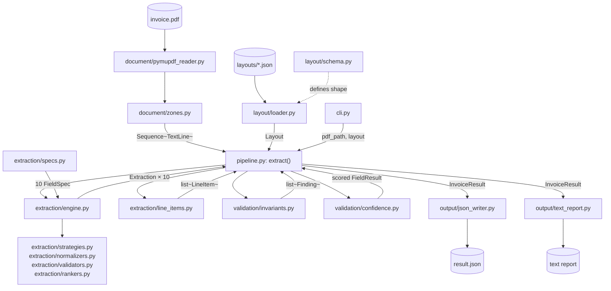
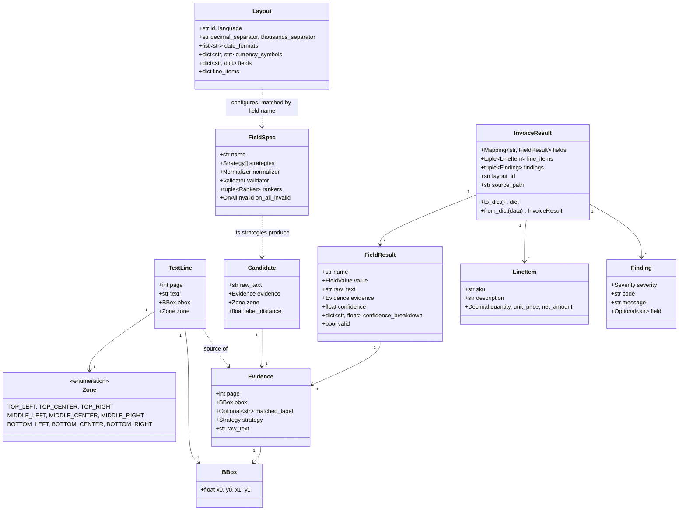
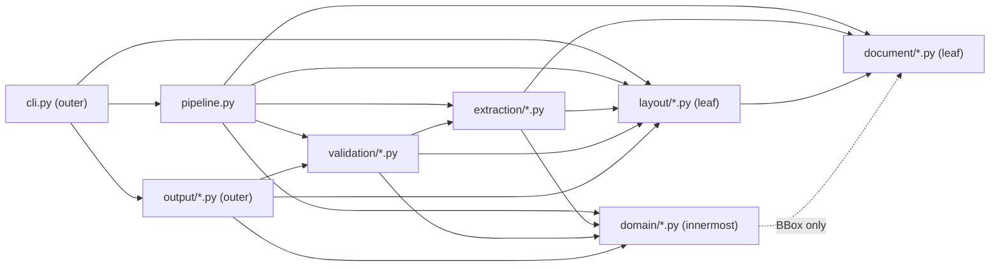

# Architecture

> This document describes the v0.1 design, which series E is evolving. Where it and
> `docs/ENGINE_SPEC.md` disagree, `ENGINE_SPEC.md` wins; PR E6 rewrites this document for
> v0.3. What has already changed under it: a vendor is described by a **profile**
> (`profiles/*.json`, `profile/`) rather than a layout, and the line-item column `sku` is
> called `part_number` — `docs/PROFILE_FORMAT.md` and `docs/FIELD_CATALOG.md` are the
> current contracts for both.

`invoice-extractor` turns a PDF invoice into a typed, evidence-backed `InvoiceResult`. The design fits in one sentence: **read raw text, match it against a data-driven layout, and never let a computed value travel without the evidence that produced it.** The five boundaries in §3 keep that sentence true as the codebase grows.

## 1. Data flow

Arrows show data moving, not who may import whom — that question is answered in §7.



## 2. Domain model



`FieldValue` is `str | datetime.date | Decimal`, chosen per field. `LineItem` carries no `Evidence`: line items are located as a table (header row plus column x-ranges), not chosen among ranked candidates, so there is no ranking decision to audit — `docs/SAMPLES_SPEC.md` fixes the JSON shape accordingly. `InvoiceResult.fields` is keyed by field name and always holds all ten names, in `extraction/specs.py` order. `Strategy` (in `domain/models.py`, next to the `Evidence` that carries it), `Normalizer`, `Validator`, `Ranker`, `OnAllInvalid` (in `extraction/spec.py`) and `Severity` (in `domain/findings.py`) are the closed vocabularies, referenced above by type rather than drawn as their own boxes.

## 3. The five boundaries

| # | Boundary | Rule |
|---|---|---|
| 1 | PDF library | `pymupdf` is imported nowhere except `document/pymupdf_reader.py`. Every other module sees the `DocumentReader` protocol and plain `TextLine` / `BBox` values — swapping the PDF library touches one file. |
| 2 | Layout format | Only `layout/loader.py` (guided by `layout/schema.py`) knows the JSON shape. Every other module receives a typed `Layout`, never a raw `dict`. |
| 3 | Strategies & units | `extraction/strategies.py`, `normalizers.py`, `validators.py`, and `rankers.py` are pure functions: inputs to outputs, no I/O, no shared state — trivial to unit test and free to compose. |
| 4 | Orchestration | `pipeline.py` is the only module that *runs* the stages across `document/`, `layout/`, `extraction/`, `validation/`, and `domain/`: nothing else opens a document, loops over the specs, or decides what happens next. Two modules import a name from a package they do not orchestrate — `validation/confidence.py` takes the `Extraction` the pipeline hands it, and `output/text_report.py` reads `INVARIANT_NAMES` to know which rows to print — and neither calls back into the package it names. |
| 5 | Output | `output/json_writer.py` and `output/text_report.py` serialize an already-built `InvoiceResult`. They never compute a value, re-derive confidence, or re-run a strategy. |

## 4. Module responsibilities

| Module | Responsibility | Depends on |
|---|---|---|
| `__init__.py` | Public API: `extract`, `load_layout`, `InvoiceResult`, `Layout`, `LayoutError`, `__version__`, `__all__`. | `pipeline`, `layout.loader`, `layout.schema`, `domain.models` |
| `cli.py` (+ `__main__.py`) | Parses arguments, calls `extract`, writes JSON and/or a text report; `__main__.py` makes it runnable as `python -m invoice_extractor`. | `pipeline`, `layout.loader`, `layout.schema`, `output.json_writer`, `output.text_report` |
| `pipeline.py` | The only orchestration: wires a reader, a layout, the extraction engine, invariants, and confidence into one `InvoiceResult`. | `document.pymupdf_reader`, `document.reader`, `layout.schema`, `extraction.engine`, `extraction.specs`, `extraction.line_items`, `validation.invariants`, `validation.confidence`, `domain.models` |
| `domain/models.py` | Defines `Evidence`, `FieldResult`, `LineItem`, `InvoiceResult`, and their `to_dict` / `from_dict`. | `document.reader` (`BBox`), `domain.findings` (`Finding`) |
| `domain/money.py` | `Decimal` rounding and tolerance helpers shared by normalizers and invariants. | — |
| `domain/findings.py` | Defines `Finding` and its `Severity` (`INFO` / `WARNING` / `ERROR`). | — |
| `document/reader.py` | Defines `BBox`, `TextLine`, `Zone`, and the `DocumentReader` protocol. | — |
| `document/pymupdf_reader.py` | The only module that imports `pymupdf`; implements `DocumentReader` over a real PDF. | `document.reader`, `document.zones` |
| `document/zones.py` | Maps a `BBox` centre, normalised to page size, onto the 3x3 `Zone` grid. | `document.reader` |
| `layout/schema.py` | The typed shape of a layout: field labels, zones, regex, line-item headers. | `document.reader` (`Zone`) |
| `layout/loader.py` | Parses and validates a layout JSON file into a `Layout`; the only module that reads the JSON shape. | `layout.schema`, `document.reader` (`Zone`) |
| `extraction/spec.py` | Defines `FieldSpec`, `Candidate`, `Evaluated` and the `OnAllInvalid` vocabulary; re-exports `Strategy`. | `domain.models` (`Evidence`, `FieldValue`, `Strategy`), `document.reader` (`Zone`), `layout.schema` (`FieldLayout`, `Layout`) |
| `extraction/strategies.py` | `label_right`, `label_below`, `regex_anchor` — pure functions from text lines to candidates. | `document.reader`, `extraction.spec`, `domain.models`, `layout.schema` |
| `extraction/normalizers.py` | `parse_number` — the one implementation of the layout's separator rules — and the five normalizers built on it: `strip_label`, `parse_date`, `parse_money`, `parse_percent`, `upper_alnum`. Each returns `None` on failure and never raises. | `extraction.spec`, `layout.schema` |
| `extraction/validators.py` | The matching predicates `matches_pattern`, `is_date`, `is_positive_money`, `is_currency_code`, `is_percent`. | `extraction.spec`, `layout.schema`, `domain.models` (`FieldValue`) |
| `extraction/rankers.py` | `valid_first`, `zone_priority`, `closest_to_label`, `top_most` — order candidates. | `extraction.spec`, `layout.schema` |
| `extraction/engine.py` | Runs one `FieldSpec` against a `Layout` and a page's text lines to produce one `FieldResult`. | `extraction.*`, `document.reader`, `layout.schema`, `domain.models` |
| `extraction/specs.py` | The 10 scalar `FieldSpec` instances, in field order. | `extraction.spec`, `extraction.normalizers` / `.validators` / `.rankers`, `domain.models` (`Strategy`) |
| `extraction/line_items.py` | Extracts the line-item table using the layout's header and stop labels. | `document.reader`, `layout.schema`, `domain.models`, `domain.findings`, `extraction.normalizers` |
| `validation/invariants.py` | `totals_reconcile`, `line_items_sum`, `vat_rate_consistent` — each emits a `Finding`, never raises. | `domain.models`, `domain.findings`, `domain.money` |
| `validation/confidence.py` | Combines named signals into a `FieldResult.confidence` and its breakdown. | `domain.models`, `domain.findings`, `extraction.engine` (`Extraction`), `layout.schema` (`FieldLayout`) |
| `output/json_writer.py` | Serializes an already-built `InvoiceResult` as JSON (`Decimal` as string, `date` as ISO-8601). | `domain.models` |
| `output/text_report.py` | Renders the same result as the human-readable report in `README.md`. | `domain.models`, `domain.findings`, `layout.schema`, `validation.invariants` (`INVARIANT_NAMES`) |

## 5. How a field is extracted: `invoice_number` on the Acme sample

1. `pipeline.extract("acme_invoice.pdf", layout="acme")` opens the PDF through `document/pymupdf_reader.py`, which yields one `TextLine` per line of text on page 1.
2. `document/zones.py` stamps each `TextLine.zone` from its `BBox` centre, normalised against the page size — the line `"Invoice Number: INV-2024-0042"` lands in `Zone.TOP_RIGHT`.
3. `layout/loader.py` has already parsed `layouts/acme.json` into a `Layout`; `layout.fields["invoice_number"]` holds `labels=["Invoice Number"]` and `zones=[Zone.TOP_RIGHT]` — no `regex`, a label match is enough.
4. `extraction/specs.py` pairs the field name with behaviour: `FieldSpec(name="invoice_number", strategies=(LABEL_RIGHT, LABEL_BESIDE), normalizer=strip_label, validator=matches_pattern(r"[A-Z0-9][A-Z0-9/-]{2,}"), rankers=(valid_first, zone_priority, top_most), on_all_invalid=NOT_FOUND)`.
5. `extraction/engine.py` restricts the search to `TextLine`s in `Zone.TOP_RIGHT` and calls `strategies.label_right()`, which finds the label and reads the text to its right, returning `Candidate(raw_text="Invoice Number: INV-2024-0042", evidence=...)`.
6. `normalizers.strip_label()` reduces the raw text to `"INV-2024-0042"`; `validators.matches_pattern()` confirms it matches the invoice-number shape — the spec's default pattern, unless the layout's optional `regex` for this field overrides it.
7. Only one candidate exists, so `valid_first`, `zone_priority` and `top_most` have nothing to break a tie on — it wins by default.
8. `validation/confidence.py` scores the field: label matched exactly, zone matched, validator passed, single candidate, invariants agree — every signal lit, so confidence is exactly `1.00`, and the breakdown says which weight came from where.
9. The engine emits:

```python
FieldResult(
    name="invoice_number",
    value="INV-2024-0042",
    raw_text="Invoice Number: INV-2024-0042",
    evidence=Evidence(
        page=1,
        bbox=BBox(x0=400.0, y0=65.25, x1=543.39, y1=78.99),
        matched_label="Invoice Number",
        strategies=(Strategy.LABEL_RIGHT, Strategy.LABEL_BESIDE),
        raw_text="Invoice Number: INV-2024-0042",
    ),
    confidence=1.0,
    confidence_breakdown={
        "label_exact_match": 0.25,
        "in_expected_zone": 0.15,
        "validator_passed": 0.30,
        "single_candidate": 0.10,
        "invariants_agree": 0.20,
    },
    valid=True,
)
```

Every field after `value` traces back to a real line on a real page — that is the point of `Evidence`: a reviewer can always ask "where did this come from?" and get a page and a box, not a promise.

## 6. Why not exceptions, why Decimal

**Why not exceptions.** A missing field or a misprinted line is normal input, not a programmer error — the extractor's job is to keep going and report what it found. A `Finding` is a value: it can be collected, filtered by `Severity`, and returned alongside every other result from a run of a thousand invoices, with no `try/except` around each field and no one bad invoice aborting the batch. Exceptions stay reserved for what truly cannot be worked around — a layout file that fails its schema, a PDF path that does not exist. See `docs/adr/0005-findings-not-exceptions-for-domain-errors.md`.

**Why Decimal.** This library checks that `subtotal + vat_amount == total_amount` to the cent, and `float` cannot make that promise — `0.1 + 0.2` is not `0.3` in binary floating point, so an invariant built on it would flag invoices that are actually correct. `decimal.Decimal`, fed only from strings through `parse_money`, keeps money exact from the page to the report. See `docs/adr/0003-money-is-decimal-never-float.md`.

## 7. The dependency rule

Read outward to inward: **`output → pipeline → extraction / validation → domain`.** `document/` and `layout/` are leaves — the layers above use them, but they depend on nothing else in this project.



No arrow points the other way: `document/reader.py` never imports `domain/`, `layout/`, `extraction/`, `validation/`, `pipeline.py`, or `output/`. The one exception is deliberate and narrow — `domain/models.py` reuses `document.reader.BBox` inside `Evidence` instead of redefining geometry, an edge that carries no dependency on `pymupdf`, which stays confined to `pymupdf_reader.py`.

Two arrows are worth naming because they cross rings rather than descend one. `validation/confidence.py` imports `Extraction` from `extraction/engine.py`, and `output/text_report.py` imports `INVARIANT_NAMES` from `validation/invariants.py`. Both are the *name of a value the caller is handed*, not a call back into that package — `score` is given an `Extraction` by `pipeline.py`, and the report prints one row per invariant in the order that tuple fixes. Boundary 4 in §3 is about who runs the stages, and `pipeline.py` is still the only module that does.
